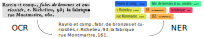

# A Dataset of French Trade Directories from the 19th Century (FTD)

This dataset is composed of pages and entries extracted from French directories published between 1798 and 1861.

The purpose of this dataset is to evaluate the performance of Optical Character Recognition (OCR) 
and Named Entity Recognition (NER) on 19th century French documents.




## How to cite this dataset
Please cite this dataset as:
```
N. Abadie, S. Baciocchi, E. Carlinet, J. Chazalon, P. Cristofoli, B. Duménieu and J. Perret, A Dataset of French Trade Directories from the 19th Century (FTD), version 1.0.0, March 2022, online at https://doi.org/10.5281/zenodo.6394464.
```

```bibtex
@dataset{abadie_dataset_22,
  author       = {Abadie, Nathalie and
                  Bacciochi, St{\'e}phane and
                  Carlinet, Edwin and
                  Chazalon, Joseph and
                  Cristofoli, Pascal and
                  Dum{\'e}nieu, Bertrand and
                  Perret, Julien},
  title        = {{A} {D}ataset of {F}rench {T}rade {D}irectories from the 19th {C}entury ({FTD})},
  month        = mar,
  year         = 2022,
  publisher    = {Zenodo},
  version      = {v1.0.0},
  doi          = {10.5281/zenodo.6394464},
  url          = {https://doi.org/10.5281/zenodo.6394464}
}
```

You may also be interested in our paper presented at DAS 2022 (15th IAPR International Workshop on Document Analysis Systems), which compares the performance of OCR and NER systems on this dataset:

```
N. Abadie, E. Carlinet, J. Chazalon and B. Duménieu, A Benchmark of Named Entity Recognition Approaches in Historical Documents — Application to 19th Century French Directories, May 2022, La Rochelle, France, Springer.
```

```bibtex
@inproceedings{abadie_das_22,
  author       = {Abadie, Nathalie and
                  Carlinet, Edwin and
                  Chazalon, Joseph and
                  Dum{\'e}nieu, Bertrand},
  title        = {{A} {B}enchmark of {N}amed {E}ntity {R}ecognition {A}pproaches in {H}istorical {D}ocuments — {A}pplication to 19th {C}entury {F}rench {D}irectories},
  month        = may,
  year         = 2022,
  publisher    = {Springer},
  place        = {La Rochelle, France}
}
```

## OCR systems used
**Tesseract** is a long-living project, born as a closed-sourced OCR at Hewlett-Packard in the eighties; it was progressively modernized, then open-sourced in 2005. From 2006 until November 2018, it was developed by Google and is still very active. We used in our tests the version 4.1.1, released Dec. 26, 2019. Version 5, released on Nov. 30, 2021, has not been integrated in our tests yet.

**Kraken** is a project created by Benjamin Kiessling several years ago (development can be traced back to 2015 at least), and is actively used in the open-source eScriptorium project.
As no pre-trained model for modern French was easily available, we used the default English text recognition model trained on modern printed English by Benjamin Kiessling on 2019. Models can be easily found and downloaded thanks to their hosting on Zenodo.

**PERO OCR** is a very recent project (started in 2020) from the Brno University of Technology in the Czech Republic.
Their authors used many state-of-the-art techniques to train it very efficiently.
We used the version from the master branch of their [GitHub repository](https://github.com/DCGM/pero-ocr), updated on Sep 15, 2021.
We used the [pre-trained weights provided by the authors](https://www.fit.vut.cz/~ihradis/pero/pero_eu_cz_print_newspapers_2020-10-09.tar.gz) on the same repository, created on Oct. 9, 2020 from European texts with Latin, Greek, and Cyrillic scripts.


## Content Overview
This dataset is divided into two parts:

1. A **labeled dataset**, 
   which contains 8765 manually corrected entries from 78 pages (18 different directories), 
   and which is designed for *supervised training*.
2. An **unlabeled dataset**,
   containing 1058196 raw entries from 6887 pages (13 different directories), 
   and which is designed for *self-supervised pre-training*.

Except for marginal errors, each "entry" correspond to a directory entry about an individual or an organization.


## Labeled dataset
This dataset is intended to be used for supervised training and evaluation.

It contains 8765 manually corrected entries from 78 pages (18 different directories), and also some unedited OCR outputs.

Files:

- `cropped/${DIR}-${PAGE}-${ENTRY}.jpg`: *directory of JPEG images*  
  8765 cropped entry images.
  Each image is in JPEG sRGB format, with various sizes and quality.
- `pages/${DIR}-${PAGE}`: *directory of JPEG images*  
  Original (resized before manual annotation) pages from which entries were detected and annotated.
  Not all entries were annotated; entries spanning multiple columns were ignored, in particular.
  Each image is in JPEG sRGB format, with various sizes and quality.
- `10-all_entries_ocr_ner_human.json`: *JSON file*  
  All information about each manually-corrected entry:  
  original directory and page, bounding box (in `(top-left x, top-left y, width, height)` format), unique identifier (for a `(book, page)` pair), target for OCR text and target for NER *(see below for details about OCR and NER data)*.
- `21-all_entries_ocr_pero.json `: *JSON file*  
  Automated transcription of each entry image using the PERO OCR engine.
- `22-all_entries_ocr_tess.json `: *JSON file*  
  *Same for Tesseract v4 OCR.*
- `23-all_entries_ocr_krak.json `: *JSON file*  
  *Same for Kraken OCR.*
- `31-all_entries_ner_align_pero.json`: *JSON file*  
  Reference NER annotations projected on PERO OCR engine predictions using the best alignment.  
  **For some entries, the projection is invalid and indicated as such: do not use these entries!**
- `32-all_entries_ner_align_tess.json`: *JSON file*  
  *Same for Tesseract v4 OCR.*
- `33-all_entries_ner_align_krak.json`: *JSON file*  
  *Same for Kraken OCR.*


Note about page images:

- Several transformations were applied on original *Gallica* images to produce these images we used for the annotation process.
- They were converted to sRGB 8-bits color, deskewed and scaled to either 1024 or 2048 pixels in width before conversion to JPEG.


Note about OCR data:

- For both human-corrected and automated text, `\n` escaped JSON sequences are used to indicate line feeds.
- For human-corrected text, we had to use several special Unicode codepoints from [Private User Area](https://en.wikipedia.org/w/index.php?title=Private_Use_Areas&oldid=1075087310) to annotate glyphs for which no relevant Unicode codepoint was available as of Unicode 14.0.
- For automated text, Latin, Greek and Cyrillic charsets are used.
- **We encourage you to check the charset of each file before processing them.**


Note about NER data:

- For both human-corrected and automated text, characters are exactly the same as in the OCR field except for:
  - annotation tags (see below),
  - `U+2029` ("paragraph separator) Unicode characters used to indicate line feeds instead of `\n`,
  - `<`, `>`, `&`, `'` and `"` characters are escaped using their corresponding XML entities.
- Entities are annotated using XML-like tags which cannot overlap nor be nested.


Table of entities to recognize in the dataset

| Entity   | Count | Description                                                                                                                                                                                                                  |
| -------- | ----- | ---------------------------------------------------------------------------------------------------------------------------------------------------------------------------------------------------------------------------- |
| PER      | 8788  | a person name or a business name, usually referred to as several person names. First names, initials, or civility mentions are included. E.g.: *Alibert (Prosper)*, *Allamand frères et Hersent*,*Heurtemotte (Vve)*.        |
| TITLE    | 483   | an honorary title, either text, glyphs or a combination of the two. E.g: O.  for *Officier de la Légion d'Honneur* or  for the Great Medal at the London exhibition. |
| ACT      | 6472  | the profession or social status of a person summarised in the single concept of activity. E.g.: *horlogerie*, *export en tous genres*, *Conseiller d'État*, *propriétaire*.                                                  |
| LOC      | 9709  | mostly street names (*r. de la Jussienne*), but may also be neighbourhoods (*Marais du Temple*) or any indirect spatial references (*au Palais Royal*).                                                                      |
| CARDINAL | 8747  | a street number, as part of an address (16, 5 bis), or a range of numbers (e.g. 23-25 or 5 *à* 9).                                                                                                                           |
| FT       | 43    | a geographic entity type, used to give more details on a location, e.g. *boutique*, *atelier*, *fab.* or *dépôt*.                                                                                                            |


About NER reference projection on noisy OCR text:  
Details and code about this approach are available in our DAS 2022 paper (see citation above) and its [associated GitHub repository](https://github.com/soduco/paper-ner-bench-das22).


This table lists the directories selected, their layout, the structure of their entries, and the number of annotated entries according to the considered index.
Letters next to year of publication are used to identify the volume of the directory.
*# Col* stands for "Number of columns", and *# Ann* stands for "Number of annotated entries".  
Entry structure is described as follows:

- `N` - entry name (person or business); 
- `F` - first name; 
- `T` - honorary title; 
- `C` - civility; 
- `A` - activity; 
- `P` - precision; 
- `SN` - street name; 
- `SNUM` - street number; 
- `SEC` - section; 
- `D` - district; 
- `CR` - cross-reference; 
- bracketed elements are optional.


| Directory publisher or name    | Year  | *# Col* | Index       | General entry structure             | *# Ann* |
| ------------------------------ | ----- | ------- | ----------- | ----------------------------------- | ------- |
| Favre & Duchesne               | 1798  | 1       | by activity | `N [A], SN, SNUM - SEC.`            | 233     |
| Duverneuil et La Tynna         | 1801  | 1       | by activity | `N, SN, SNUM. SEC.`                 | 136     |
| Duverneuil et La Tynna         | 1801  | 1       | by name     | `N, SN, SNUM. SEC.`                 | 103     |
| Notables communaux de la Seine | 1801  | 1       | by name     | `N, [A,] SN[, SNUM].`               | 92      |
| Duverneuil et La Tynna         | 1805  | 2       | by name     | `N [(F)], SN, SNUM. - SEC.`         | 155     |
| Duverneuil et La Tynna         | 1805  | 2       | by name     | `N [(C)], [(A),] SN, SNUM. - SEC.`  | 221     |
| Duverneuil et La Tynna         | 1806  | 2       | by activity | `N [(F)], SN, SNUM.`                | 186     |
| La Tynna                       | 1813  | 2       | by activity | `N,[A,] SN[, SNUM].`                | 135     |
| La Tynna                       | 1813  | 2       | by name     | `N, [(T)] A, SN[, SNUM] [, D].`     | 177     |
| Bottin (serie 1: 1819-1838)    | 1820  | 2       | by activity | `N [(F \| C)][T], [P], SN, SNUM.`   | 128     |
| Bottin (serie 1: 1819-1838)    | 1820  | 2       | by name     | `N [(F \| C)][T], A, SN, SNUM. CR`  | 151     |
| Bottin (serie 1: 1819-1838)    | 1827  | 2       | by activity | `N [(F \| C)][T], [P], SN, SNUM.`   | 228     |
| Bottin (serie 1: 1819-1838)    | 1827  | 2       | by name     | `N [(F \| C)][T], A, SN, SNUM.`     | 285     |
| Deflandre                      | 1828  | 2       | by activity | `N [(F \| C)][T], [P], SN, SNUM.`   | 115     |
| Deflandre                      | 1828  | 2       | by name     | `N [(F \| C)][T], A, SN, SNUM.`     | 229     |
| Deflandre                      | 1829  | 2       | by activity | `N [(F \| C)][T], [P], SN, SNUM.`   | 177     |
| Deflandre                      | 1829  | 2       | by name     | `N [(F \| C)][T], A, SN, SNUM.`     | 236     |
| Bottin (serie 1: 1819-1838)    | 1837  | 2       | by activity | `N [(F \| C)][T], [P], SN, SNUM.`   | 158     |
| Bottin (serie 1: 1819-1838)    | 1837  | 2       | by name     | `N [(F \| C)][T], [A], SN, SNUM.`   | 557     |
| Cambon - Almanach général      | 1841  | 2       | by activity | `N [(F \| C)][T], [P], SN, SNUM.`   | 182     |
| Cambon - Almanach général      | 1841  | 2       | by name     | `N [(F \| C)][T], A, SN, SNUM.`     | 486     |
| Didot                          | 1841a | 3       | by activity | `N [(F \| C)][T], [P], SN, SNUM.`   | 246     |
| Didot                          | 1841a | 4       | by name     | `N [(F \| C)][T], [A], SN, SNUM.`   | 843     |
| Didot                          | 1851a | 4       | by activity | `N [(F \| C)][T], [P], SN, SNUM.`   | 309     |
| Didot                          | 1851a | 4       | by name     | `N [(F \| C)][T], [A], SN, SNUM.`   | 961     |
| Didot                          | 1854a | 4       | by activity | `N [(F \| C)], [P], SN, SNUM [,T].` | 106     |
| Didot                          | 1854a | 3       | by name     | `N [(F \| C)][T], [A], SN, SNUM.`   | 362     |
| Bottin (serie 3: 1854-1856)    | 1854a | 3       | by activity | `N [(F \| C)], [P], SN, SNUM [,T].` | 253     |
| Bottin (serie 3: 1854-1856)    | 1854a | 2       | by name     | `N [(F \| C)][T], [A], SN, SNUM.`   | 633     |
| Didot-Bottin                   | 1860a | 3       | by name     | `N [(F \| C)][T], [A], SN, SNUM.`   | 378     |
| Didot-Bottin                   | 1861a | 3       | by name     | `N [(F \| C)][T], [A], SN, SNUM.`   | 402     |


## Unlabeled dataset
This dataset is intended for unsupervised pre-training.

It contains 1058196 raw entries from 6887 pages (13 different directories), 

We provide only the **unedited raw text** produced by our automated layout analysis tool (unpublished) and Pero OCR for the unlabeled dataset.

Files:

- `all.json.gz`: **GZipped JSON file**  
  All information about each entry in a single JSON file:  
  original directory and page, bounding box (in `(top-left x, top-left y, width, height)` format), unique identifier (for a `(book, page)` pair) and raw OCR text produced by PERO OCR.
- `all.txt.gz`: **GZipped UTF8 text file**  
  All raw entries in a single big text file in the format we used for pre-training.
  * `\n` line separators are used to separate entries.
  * `U+2029` "paragraph separator" character are used to indicate line feed within an entry.
  * There may be many characters not in Latin script, as the OCR can produce Greek and Cyrillic characters as well.

Order should be preserved between the two files, but empty entries were removed.

Sample entry from `all.json.gz`:
```json
{
 'id': 262,
 'box': [138, 133, 722, 68],
 'book': 'Duverneuil_et_La_Tynna_1805',
 'page': '234',
 'text_ocr': 'Negoctans.\n116\nOberkampf (prop. de la manuf. de Jouy), Poitier (J. J. X.). ( en clouterie , armes\net alun de Liége), R. S. Denis, 5. —\npied-à-terre R. de Choiseul. 714. Lep.'
}
```

The following tables indicates the number of page used from each directory.

| Directory                   | Pages |
| --------------------------- | ----- |
| Bottin1_1827                | 546   |
| Bottin1_1837                | 695   |
| Bottin3_1854a               | 1031  |
| Cambon_almgene_1841         | 8     |
| Deflandre_1828              | 24    |
| Didot_1841a                 | 602   |
| Didot_1851a                 | 1031  |
| Didot_1854a                 | 1149  |
| DidotBottin_1860a           | 445   |
| DidotBottin_1861a           | 456   |
| Duverneuil_et_La_Tynna_1805 | 198   |
| Favre_et_Duchesne_1798      | 552   |
| La_Tynna_1813               | 150   |


## Copyright
The images were extracted from the original source https://gallica.bnf.fr, owned by the *Bibliothèque nationale de France* (French national library).
Original contents from the *Bibliothèque nationale de France* can be reused non-commercially, provided the mention "Source gallica.bnf.fr / Bibliothèque nationale de France" is kept.  
**Researchers do not have to pay any fee for reusing the original contents in research publications or academic works.**  
*Original copyright mentions extracted from https://gallica.bnf.fr/edit/und/conditions-dutilisation-des-contenus-de-gallica on March 29, 2022.*

The original contents were significantly transformed before being included in this dataset.
All derived content is licensed under the permissive *Creative Commons Attribution 4.0 International* license.

Links to original contents

| Directory                     | Page | Link to document                                | Link to page                                               |
| ----------------------------- | ---- | ----------------------------------------------- | ---------------------------------------------------------- |
| Bottin1_1820                  | 107  | https://gallica.bnf.fr/ark:/12148/bpt6k1245624  | https://gallica.bnf.fr/ark:/12148/bpt6k1245624/f108.item   |
| Bottin1_1820                  | 201  | https://gallica.bnf.fr/ark:/12148/bpt6k1245624  | https://gallica.bnf.fr/ark:/12148/bpt6k1245624/f202.item   |
| Bottin1_1820                  | 339  | https://gallica.bnf.fr/ark:/12148/bpt6k1245624  | https://gallica.bnf.fr/ark:/12148/bpt6k1245624/f340.item   |
| Bottin1_1820                  | 589  | https://gallica.bnf.fr/ark:/12148/bpt6k1245624  | https://gallica.bnf.fr/ark:/12148/bpt6k1245624/f590.item   |
| Bottin1_1827                  | 37   | https://gallica.bnf.fr/ark:/12148/bpt6k6292888w | https://gallica.bnf.fr/ark:/12148/bpt6k6292888w/f35.item   |
| Bottin1_1827                  | 117  | https://gallica.bnf.fr/ark:/12148/bpt6k6292888w | https://gallica.bnf.fr/ark:/12148/bpt6k6292888w/f115.item  |
| Bottin1_1827                  | 452  | https://gallica.bnf.fr/ark:/12148/bpt6k6292888w | https://gallica.bnf.fr/ark:/12148/bpt6k6292888w/f450.item  |
| Bottin1_1827                  | 475  | https://gallica.bnf.fr/ark:/12148/bpt6k6292888w | https://gallica.bnf.fr/ark:/12148/bpt6k6292888w/f473.item  |
| Bottin1_1837                  | 80   | https://gallica.bnf.fr/ark:/12148/bpt6k6290660h | https://gallica.bnf.fr/ark:/12148/bpt6k6290660h/f79.item   |
| Bottin1_1837                  | 114  | https://gallica.bnf.fr/ark:/12148/bpt6k6290660h | https://gallica.bnf.fr/ark:/12148/bpt6k6290660h/f113.item  |
| Bottin1_1837                  | 203  | https://gallica.bnf.fr/ark:/12148/bpt6k6290660h | https://gallica.bnf.fr/ark:/12148/bpt6k6290660h/f202.item  |
| Bottin1_1837                  | 345  | https://gallica.bnf.fr/ark:/12148/bpt6k6290660h | https://gallica.bnf.fr/ark:/12148/bpt6k6290660h/f344.item  |
| Bottin1_1837                  | 663  | https://gallica.bnf.fr/ark:/12148/bpt6k6290660h | https://gallica.bnf.fr/ark:/12148/bpt6k6290660h/f662.item  |
| Bottin1_1837                  | 667  | https://gallica.bnf.fr/ark:/12148/bpt6k6290660h | https://gallica.bnf.fr/ark:/12148/bpt6k6290660h/f666.item  |
| Bottin3_1854a                 | 72   | https://gallica.bnf.fr/ark:/12148/bpt6k6269398w | https://gallica.bnf.fr/ark:/12148/bpt6k6269398w/f71.item   |
| Bottin3_1854a                 | 74   | https://gallica.bnf.fr/ark:/12148/bpt6k6269398w | https://gallica.bnf.fr/ark:/12148/bpt6k6269398w/f73.item   |
| Bottin3_1854a                 | 200  | https://gallica.bnf.fr/ark:/12148/bpt6k6269398w | https://gallica.bnf.fr/ark:/12148/bpt6k6269398w/f199.item  |
| Bottin3_1854a                 | 238  | https://gallica.bnf.fr/ark:/12148/bpt6k6269398w | https://gallica.bnf.fr/ark:/12148/bpt6k6269398w/f237.item  |
| Bottin3_1854a                 | 892  | https://gallica.bnf.fr/ark:/12148/bpt6k6269398w | https://gallica.bnf.fr/ark:/12148/bpt6k6269398w/f891.item  |
| Bottin3_1854a                 | 1049 | https://gallica.bnf.fr/ark:/12148/bpt6k6269398w | https://gallica.bnf.fr/ark:/12148/bpt6k6269398w/f1048.item |
| Cambon_almgene_1841           | 141  | https://gallica.bnf.fr/ark:/12148/bpt6k63482147 | https://gallica.bnf.fr/ark:/12148/bpt6k63482147/f139.item  |
| Cambon_almgene_1841           | 301  | https://gallica.bnf.fr/ark:/12148/bpt6k63482147 | https://gallica.bnf.fr/ark:/12148/bpt6k63482147/f299.item  |
| Cambon_almgene_1841           | 330  | https://gallica.bnf.fr/ark:/12148/bpt6k63482147 | https://gallica.bnf.fr/ark:/12148/bpt6k63482147/f328.item  |
| Cambon_almgene_1841           | 375  | https://gallica.bnf.fr/ark:/12148/bpt6k63482147 | https://gallica.bnf.fr/ark:/12148/bpt6k63482147/f373.item  |
| Cambon_almgene_1841           | 418  | https://gallica.bnf.fr/ark:/12148/bpt6k63482147 | https://gallica.bnf.fr/ark:/12148/bpt6k63482147/f416.item  |
| Cambon_almgene_1841           | 487  | https://gallica.bnf.fr/ark:/12148/bpt6k63482147 | https://gallica.bnf.fr/ark:/12148/bpt6k63482147/f485.item  |
| Deflandre_1828                | 278  | https://gallica.bnf.fr/ark:/12148/bpt6k6525634c | https://gallica.bnf.fr/ark:/12148/bpt6k6525634c/f276.item  |
| Deflandre_1828                | 310  | https://gallica.bnf.fr/ark:/12148/bpt6k6525634c | https://gallica.bnf.fr/ark:/12148/bpt6k6525634c/f308.item  |
| Deflandre_1828                | 881  | https://gallica.bnf.fr/ark:/12148/bpt6k6525634c | https://gallica.bnf.fr/ark:/12148/bpt6k6525634c/f879.item  |
| Deflandre_1828                | 937  | https://gallica.bnf.fr/ark:/12148/bpt6k6525634c | https://gallica.bnf.fr/ark:/12148/bpt6k6525634c/f935.item  |
| Deflandre_1829                | 505  | https://gallica.bnf.fr/ark:/12148/bpt6k6451715q | https://gallica.bnf.fr/ark:/12148/bpt6k6451715q/f503.item  |
| Deflandre_1829                | 743  | https://gallica.bnf.fr/ark:/12148/bpt6k6451715q | https://gallica.bnf.fr/ark:/12148/bpt6k6451715q/f741.item  |
| Deflandre_1829                | 949  | https://gallica.bnf.fr/ark:/12148/bpt6k6451715q | https://gallica.bnf.fr/ark:/12148/bpt6k6451715q/f947.item  |
| Deflandre_1829                | 1026 | https://gallica.bnf.fr/ark:/12148/bpt6k6451715q | https://gallica.bnf.fr/ark:/12148/bpt6k6451715q/f1024.item |
| Didot_1841a                   | 162  | https://gallica.bnf.fr/ark:/12148/bpt6k62931221 | https://gallica.bnf.fr/ark:/12148/bpt6k62931221/f160.item  |
| Didot_1841a                   | 183  | https://gallica.bnf.fr/ark:/12148/bpt6k62931221 | https://gallica.bnf.fr/ark:/12148/bpt6k62931221/f181.item  |
| Didot_1841a                   | 206  | https://gallica.bnf.fr/ark:/12148/bpt6k62931221 | https://gallica.bnf.fr/ark:/12148/bpt6k62931221/f204.item  |
| Didot_1841a                   | 316  | https://gallica.bnf.fr/ark:/12148/bpt6k62931221 | https://gallica.bnf.fr/ark:/12148/bpt6k62931221/f314.item  |
| Didot_1841a                   | 500  | https://gallica.bnf.fr/ark:/12148/bpt6k62931221 | https://gallica.bnf.fr/ark:/12148/bpt6k62931221/f498.item  |
| Didot_1841a                   | 542  | https://gallica.bnf.fr/ark:/12148/bpt6k62931221 | https://gallica.bnf.fr/ark:/12148/bpt6k62931221/f540.item  |
| Didot_1851a                   | 92   | https://gallica.bnf.fr/ark:/12148/bpt6k63959929 | https://gallica.bnf.fr/ark:/12148/bpt6k63959929/f90.item   |
| Didot_1851a                   | 169  | https://gallica.bnf.fr/ark:/12148/bpt6k63959929 | https://gallica.bnf.fr/ark:/12148/bpt6k63959929/f167.item  |
| Didot_1851a                   | 226  | https://gallica.bnf.fr/ark:/12148/bpt6k63959929 | https://gallica.bnf.fr/ark:/12148/bpt6k63959929/f224.item  |
| Didot_1851a                   | 415  | https://gallica.bnf.fr/ark:/12148/bpt6k63959929 | https://gallica.bnf.fr/ark:/12148/bpt6k63959929/f413.item  |
| Didot_1851a                   | 419  | https://gallica.bnf.fr/ark:/12148/bpt6k63959929 | https://gallica.bnf.fr/ark:/12148/bpt6k63959929/f417.item  |
| Didot_1851a                   | 639  | https://gallica.bnf.fr/ark:/12148/bpt6k63959929 | https://gallica.bnf.fr/ark:/12148/bpt6k63959929/f637.item  |
| Didot_1851a                   | 698  | https://gallica.bnf.fr/ark:/12148/bpt6k63959929 | https://gallica.bnf.fr/ark:/12148/bpt6k63959929/f696.item  |
| Didot_1854a                   | 83   | https://gallica.bnf.fr/ark:/12148/bpt6k6319811j | https://gallica.bnf.fr/ark:/12148/bpt6k6319811j/f81.item   |
| Didot_1854a                   | 326  | https://gallica.bnf.fr/ark:/12148/bpt6k6319811j | https://gallica.bnf.fr/ark:/12148/bpt6k6319811j/f324.item  |
| Didot_1854a                   | 607  | https://gallica.bnf.fr/ark:/12148/bpt6k6319811j | https://gallica.bnf.fr/ark:/12148/bpt6k6319811j/f605.item  |
| DidotBottin_1860a             | 186  | https://gallica.bnf.fr/ark:/12148/bpt6k63243920 | https://gallica.bnf.fr/ark:/12148/bpt6k63243920/f184.item  |
| DidotBottin_1860a             | 280  | https://gallica.bnf.fr/ark:/12148/bpt6k63243920 | https://gallica.bnf.fr/ark:/12148/bpt6k63243920/f278.item  |
| DidotBottin_1861a             | 238  | https://gallica.bnf.fr/ark:/12148/bpt6k6309075f | https://gallica.bnf.fr/ark:/12148/bpt6k6309075f/f236.item  |
| DidotBottin_1861a             | 424  | https://gallica.bnf.fr/ark:/12148/bpt6k6309075f | https://gallica.bnf.fr/ark:/12148/bpt6k63243920/f422.item  |
| Duverneuil_et_La_Tynna_1801   | 260  | https://gallica.bnf.fr/ark:/12148/bpt6k1175057p | https://gallica.bnf.fr/ark:/12148/bpt6k1175057p/f258.item  |
| Duverneuil_et_La_Tynna_1801   | 371  | https://gallica.bnf.fr/ark:/12148/bpt6k1175057p | https://gallica.bnf.fr/ark:/12148/bpt6k1175057p/f369.item  |
| Duverneuil_et_La_Tynna_1801   | 401  | https://gallica.bnf.fr/ark:/12148/bpt6k1175057p | https://gallica.bnf.fr/ark:/12148/bpt6k1175057p/f399.item  |
| Duverneuil_et_La_Tynna_1801   | 415  | https://gallica.bnf.fr/ark:/12148/bpt6k1175057p | https://gallica.bnf.fr/ark:/12148/bpt6k1175057p/f413.item  |
| Duverneuil_et_La_Tynna_1801   | 454  | https://gallica.bnf.fr/ark:/12148/bpt6k1175057p | https://gallica.bnf.fr/ark:/12148/bpt6k1175057p/f452.item  |
| Duverneuil_et_La_Tynna_1805   | 193  | https://gallica.bnf.fr/ark:/12148/bpt6k62915570 | https://gallica.bnf.fr/ark:/12148/bpt6k62915570/f191.item  |
| Duverneuil_et_La_Tynna_1805   | 250  | https://gallica.bnf.fr/ark:/12148/bpt6k62915570 | https://gallica.bnf.fr/ark:/12148/bpt6k62915570/f248.item  |
| Duverneuil_et_La_Tynna_1805   | 251  | https://gallica.bnf.fr/ark:/12148/bpt6k62915570 | https://gallica.bnf.fr/ark:/12148/bpt6k62915570/f249.item  |
| Duverneuil_et_La_Tynna_1805   | 292  | https://gallica.bnf.fr/ark:/12148/bpt6k62915570 | https://gallica.bnf.fr/ark:/12148/bpt6k62915570/f290.item  |
| Duverneuil_et_La_Tynna_1805   | 305  | https://gallica.bnf.fr/ark:/12148/bpt6k62915570 | https://gallica.bnf.fr/ark:/12148/bpt6k62915570/f303.item  |
| Duverneuil_et_La_Tynna_1806   | 147  | https://gallica.bnf.fr/ark:/12148/bpt6k1245569  | https://gallica.bnf.fr/ark:/12148/bpt6k1245569/f145.item   |
| Duverneuil_et_La_Tynna_1806   | 220  | https://gallica.bnf.fr/ark:/12148/bpt6k1245569  | https://gallica.bnf.fr/ark:/12148/bpt6k1245569/f218.item   |
| Favre_et_Duchesne_1798        | 375  | https://gallica.bnf.fr/ark:/12148/bpt6k62929887 | https://gallica.bnf.fr/ark:/12148/bpt6k62929887/f373.item  |
| Favre_et_Duchesne_1798        | 429  | https://gallica.bnf.fr/ark:/12148/bpt6k62929887 | https://gallica.bnf.fr/ark:/12148/bpt6k62929887/f427.item  |
| Favre_et_Duchesne_1798        | 625  | https://gallica.bnf.fr/ark:/12148/bpt6k62929887 | https://gallica.bnf.fr/ark:/12148/bpt6k62929887/f623.item  |
| Favre_et_Duchesne_1798        | 658  | https://gallica.bnf.fr/ark:/12148/bpt6k62929887 | https://gallica.bnf.fr/ark:/12148/bpt6k62929887/f656.item  |
| Favre_et_Duchesne_1798        | 700  | https://gallica.bnf.fr/ark:/12148/bpt6k62929887 | https://gallica.bnf.fr/ark:/12148/bpt6k62929887/f698.item  |
| Favre_et_Duchesne_1798        | 701  | https://gallica.bnf.fr/ark:/12148/bpt6k62929887 | https://gallica.bnf.fr/ark:/12148/bpt6k62929887/f699.item  |
| La_Tynna_1813                 | 163  | https://gallica.bnf.fr/ark:/12148/bpt6k62915718 | https://gallica.bnf.fr/ark:/12148/bpt6k62915718/f164.item  |
| La_Tynna_1813                 | 166  | https://gallica.bnf.fr/ark:/12148/bpt6k62915718 | https://gallica.bnf.fr/ark:/12148/bpt6k62915718/f167.item  |
| La_Tynna_1813                 | 346  | https://gallica.bnf.fr/ark:/12148/bpt6k62915718 | https://gallica.bnf.fr/ark:/12148/bpt6k62915718/f347.item  |
| La_Tynna_1813                 | 377  | https://gallica.bnf.fr/ark:/12148/bpt6k62915718 | https://gallica.bnf.fr/ark:/12148/bpt6k62915718/f378.item  |
| notables_communaux_seine_1801 | 57   | https://gallica.bnf.fr/ark:/12148/bpt6k6417087j | https://gallica.bnf.fr/ark:/12148/bpt6k6417087j/f55.item   |
| notables_communaux_seine_1801 | 144  | https://gallica.bnf.fr/ark:/12148/bpt6k6417087j | https://gallica.bnf.fr/ark:/12148/bpt6k6417087j/f142.item  |


## Version and semantics
Current dataset version is `1.0.0`.

We try to adhere to [Semantic Versioning 2.0.0](https://semver.org/) despite the precise meaning for datasets is unclear.
Here are the rules we will follow, if necessary.

Given a version number MAJOR.MINOR.PATCH, we will increment the:

- MAJOR version when we make incompatible evaluation changes (add, remove, change data),
- MINOR version when we add functionality (like an export in a new archive format) in a backwards compatible manner, and
- PATCH version when we make backwards compatible bug fixes (like documentation fixes).

### Revisions
- `1.0.0` - 2022-05-17 - Initial release.

